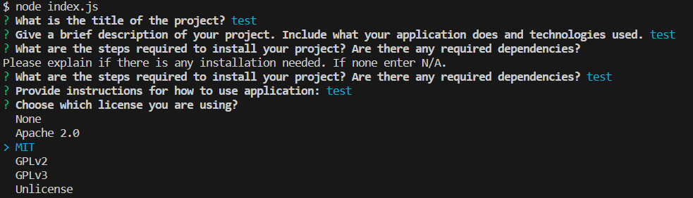
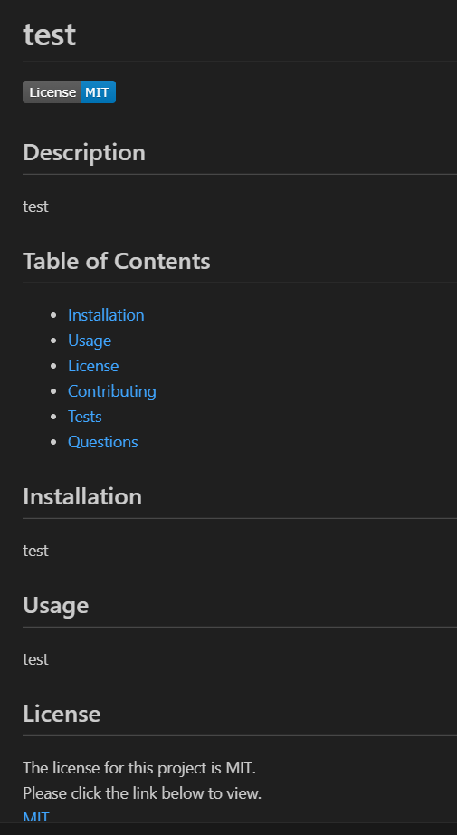

# README Generator
  
  ## Description
  This application generators a README file for projects with correct markdown syntax. README files describe a project so users know what your project does and how to use or install it. This can also contain information on how to make contributions for open-source projects for collaboration. 
  This project uses the command-line to generate a README file by prompting the user for information.

  The application was created using the following criteria:
  - A README is generated from user input with Description, Table of Contents, Installation, Usage, License, Contributing, Tests, and Questions sections
  - A license badge is displayed based on chosen license from a list of options
  - The users GitHub username displays on the README file as a link to github profile
  - The table of contents links to the corresponding section in the README

  ## Table of Contents
- [Installation](#installation)
- [Usage](#usage)
- [License](#license)
- [Contributing](#contributing)
- [Tests](#tests)
- [Questions](#questions)
 
## Installation
In order to use the application node.js will need to be installed.  
Node.js Installation: https://nodejs.org/en/download 

The inquirer package was used to ask questions and get user input from command line. 

## Usage
Type node index.js into the terminal in order to run the program. Answer the prompts with the information for your project. If information is entered incorrectly an error message will display and the question will reappear. When the application is finished running the README will be generated with the name test.md.

 
 

## License 
None

## Contributing
The following websites were used for reference to create this application: 
https://gist.github.com/lukas-h/2a5d00690736b4c3a7ba 
https://coding-boot-camp.github.io/full-stack/github/professional-readme-guide

## Questions
Feel free to reach out to me with any questions via GitHub! 
[Github Profile](https://github.com/l-lavelle)

[Walk Thru Video Demonstration](https://drive.google.com/file/d/1R8MK2Uon8BCJZpiQjboLs3QjBi8c36FS/view)
